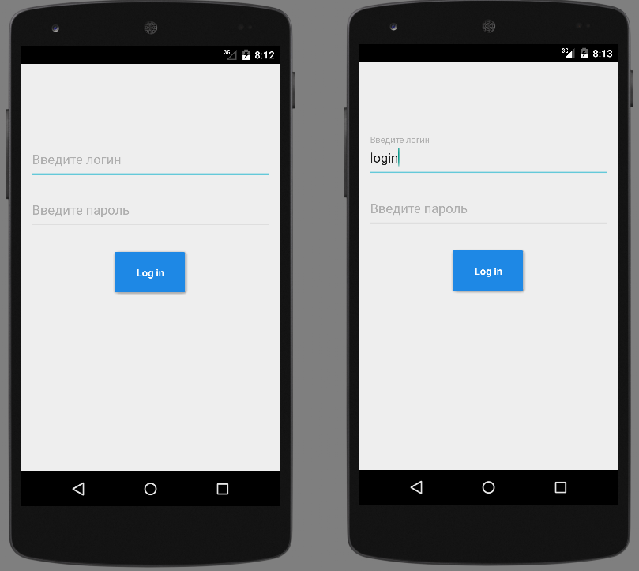
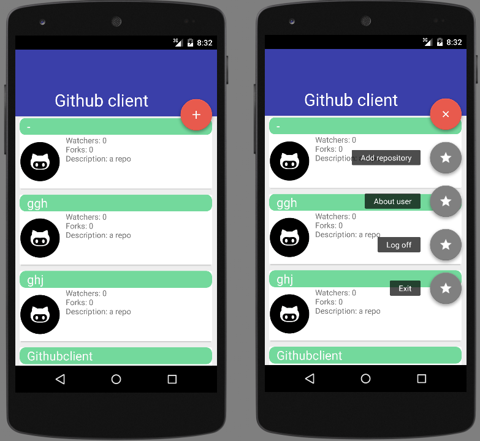
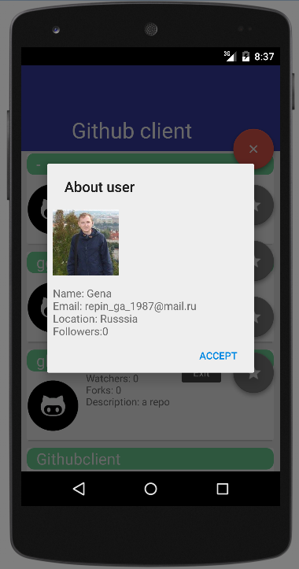
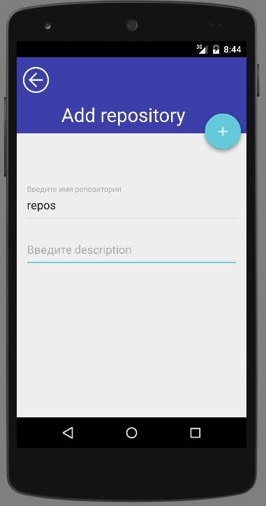

# Мобильный клиент для Github
Данный мой проект, является подобием простенького github клиента. И что же он умеет?  
1)Вывод  репозиториев пользователя (Watchers, Forks, Description). 
2)Вывод информации о пользователе(Name,Email,Location,Foloowers). 
3)Добавление нового репозитория (Нужно ввести имя репозитория и description). 
4)Ну и я постарался немного добавить material design.

Форма ввода логина:

Главное активити приложения:

Диалог при нажатии на кнопку "About user"

При нажатии на кнопку "Add repository" выводится новое активити:

